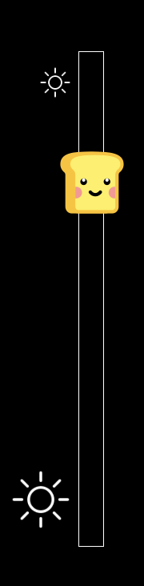
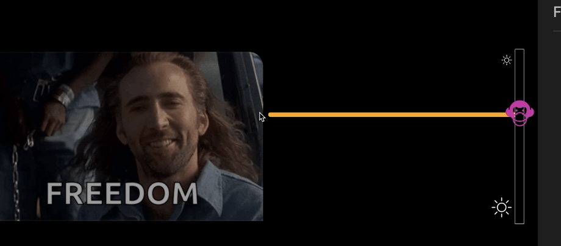

# Dimmmer JS

## About
A module that adjusts the brighness of any content (media, video, image, etc...).
Interchange the icon and the drag-color.

## features
1. Access on mobile or desktop devices (touch)
2. Available in portrait mode
3. Change icons
4. Change drag-color
5. Use this for your project

## Languages:
1. JavaScript
2. CSS
3. HTML